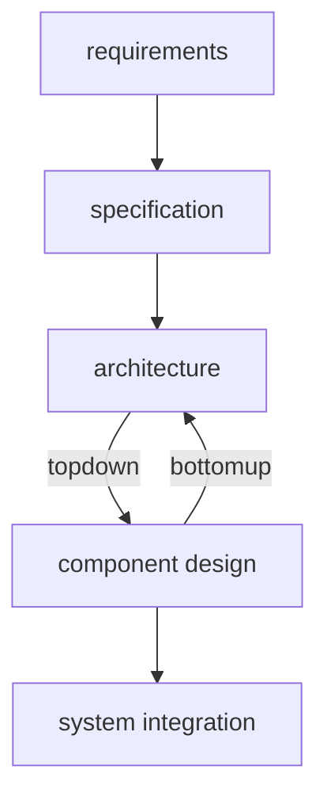
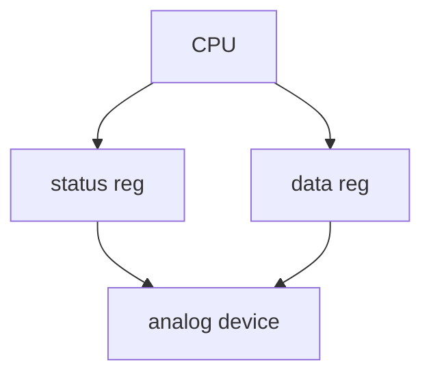
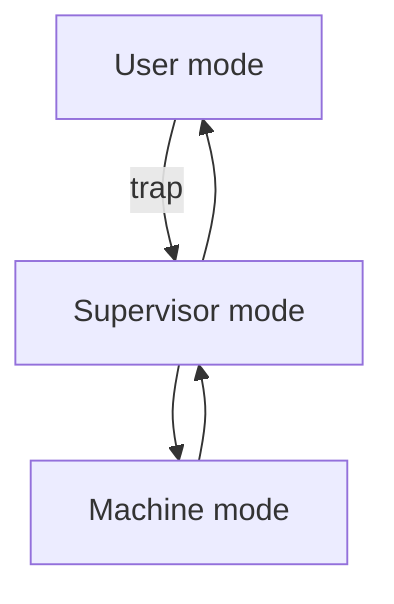

# 嵌入式系统与设计方法学
## 什么是嵌入式系统
Embedded computing system: Any device that includes a programmable computer but is not itself a general-purpose computer

嵌入式系统的组成: 
- 模拟元件: sensors, actuators, etc.
- ADC/DAC
- 数字元件: processors, Coprocessors, Memories, Buses; Controllers, Application Specific Hardwares
- 软件: Operating Systems, Middleware, Applications
基于MCU的设计简单,而且考虑到MCU本身的性能一般效果也不错；也可以用FPGA定制；Heterogeneous systems用定制逻辑完成特定功能,用MCU完成其他功能

嵌入式系统具有功能复杂、实时性、低成本、低功耗、设计周期短等特点
- 实时性: 软实时 (soft real-time) vs 硬实时 (hard real-time)

## 怎么设计嵌入式系统
例如,需求即应用场景、功能、指标描述,规格类似manual,在此基础上绘制架构框图,划分层次、模块,设计功能,最终集成



trade-offs:
- 设计本身: power(energy), performance(?), cost, 
- 开发过程: time-to-market
- 使用过程: flexibility, reliability, scalability, complexity, etc.
## 设计流程

---

# 嵌入式系统的计算核心: 处理器
考虑设计周期、灵活性、成本,嵌入式系统的处理器可以分为以下几类（可以理解为,在软件编程和硬件实现之间折衷）: 
- General-purpose processors (GP/MCU/单片机)
- Application-Specific Instruction-set Processors (ASIP): 可编程的指令集处理器,介于通用处理器和ASIC之间
- Application-Specific Integrated Circuit (ASIC): 全定制
## 计算机架构
- von Neumann架构: 存储程序计算机,数据和指令存储在同一存储器中,CPU通过总线访问存储器
- Harvard架构: 数据和指令存储在不同的存储器中,CPU通过不同的总线访问存储器, 可以同时访问两处内存(带宽),no self-modifying code
## 指令集架构
|CISC (Complex Instruction Set Computer)|RISC (Reduced Instruction Set Computer)|
|---|---|
|变长指令|定长指令(不一定!)|
|每条指令可以完成多种操作|每条指令完成单一操作(利于流水)|
|多种寻址模式|load/store访存|

一个好的架构设计出来后,可以根据不同的需求和场景,做出不同的实现版本(微架构),比如不同的主频、总线宽度、缓存大小等
- ARM:  ch2 25
- TI C55x
- RISC-V

## 设备与输入输出


- x86有专用的I/O指令(in, out)
- ARM,RISCV通过内存映射I/O (memory-mapped I/O)来访问设备

由于CPU一直等待设备的信号很低效,因此可以让设备在需要的时候发起中断,CPU做出对应的响应. 举例,输入传入字符IN_DATA,处理程序放入buffer,写入输出设备OUT_DATA
```c
void input_handler() {
    char achar;
    if (full_buffer())
        error = 1;
    else { /* read the character and update pointer */
        achar = peek(IN_DATA); 
        add_char(achar);
    }
    poke(IN_STATUS,0); /* reset status to initiate next transfer */
    /*  if no characters waiting, buffer was empty, start a new output transaction for newly-arrived character */
    if (nchars() == 1) { /* 1 character in buffer */
        poke(OUT_DATA,remove_char()); /* send character */
        poke(OUT_STATUS,1); /* turn device on */
    }
}
void output_handler() {
    if (!empty_buffer()) { /* start a new character */
        poke(OUT_DATA,remove_char()); /* send character */
        poke(OUT_STATUS,1); /* turn device on */
    }
}
```

## 特权级与异常处理
处理器通常有多种特权级,如用户模式(user mode)、监督模式(supervisor mode)、机器模式(machine mode),不同特权级可以访问不同的资源和执行不同的指令. 例如,用户程序运行在用户模式下,不能直接访问硬件设备,只能通过监督模式下的系统调用.


何为中断?
- 同步例外(exception): 指令错了, 如访问了无效的存储器地址或执行了具有无效操作码的指令
  - 自陷(trap): 用户进程软件中断, 需要更高的特权级处理
- 异步中断(interrupt): 设备发起的中断, 如键盘输入、定时器中断等

中断处理的两大机制:
- 中断向量表(interrupt vectors): 中断处理程序的入口地址存储在中断向量表中,CPU根据中断来源查找对应的处理程序. 设备中断时向CPU发送中断号,CPU查找中断向量表,跳转到对应的处理程序
- 中断优先级(interrupt priorities): 高优先级的中断会mask和打断低优先级的中断

中断处理流程:
1. 标记中断: 某个正准备处理的中断凭优先级轮到了,保存异常处PC,设置异常来源
2. 设置本次中断: PC被设置为对应的处理程序入口;(保存原来的中断使能,并设中断使能信号为0);(保存原来的特权级,切换到更高的特权级)
3. 中断处理程序: 保存寄存器到栈,执行处理程序,恢复寄存器
4. 恢复中断设置: 2的逆操作


中断除了处理本身的时间,中断前后也是需要时间准备的(要保存与恢复状态,设备与CPU通信中断号),也会耽误分支跳转,还有现代处理器采用的流水线和缓存也会miss. 不幸! 这些时间延迟大多不受控,但我们可以通过写汇编少动几个寄存器来省点时间.
{:.warning}

举例: ARM的中断
- 分为FIQ (Fast Interrupt Request)和IRQ (Normal Interrupt Request), FIQ优先级更高,可以打断IRQ
- CPU需要保存PC, 复制CPSR到SPSR, 设置CPSR来记录中断, 设置PC为中断向量表中的地址; handler最后需要逆操作, 恢复PC和CPSR, 清除中断屏蔽标志
- 最坏的情况响应中断就需要27个周期: 2个周期同步外部请求, 20个周期完成手头的指令, 3个周期data abort, 2个周期进入中断处理程序
## 内存机制
存储器的层次结构具有这样的特点: 顶层小而快(贵啊), 底层大而慢, 实现大而快的等效效果. 
### 缓存
访问内存缓慢, 因此需要缓存放指令和数据, 省的CPU苦等. (不能真去 load/store 内存啊)

我们考虑的性能指标:
- 缓存命中率 $t_{avg} = ht_{cache} + (1-h)t_{main}$
  - compulsory miss: 没用过的内存真没有
  - conflict miss: 组相连映射时,两数据块抢一个地方
  - capacity miss: 缓存不够大
- (假设写穿) 访存延迟 = 访存操作数目/程序 * 缓存失效率 * 失效代价

缓存数据的地址:
|tag|index|block offset|
|---|---|---|
|选择数据块(hit?)|选择组|选择数据|

- 映射结构: 相连提升缓存命中率,但更复杂; 数据块太大失效代价增加
  - 直接映射(direct mapped)/一路组相连: 数据块映射到缓存的确定位置, cache地址 = (块地址) mod (cache中数据块数量)
  - 组相连(set associative): 数据块映射到确定组的任意位置, cache组数 = (块地址) mod (cache中组数)
  - 全相连(fully associative): 数据块可以映射到缓存的任意位置, 需要查找所有缓存块
- 写操作
  - 写穿透(write-through): 每次写操作都更新缓存和主存, 费时. 
  - 写返回(write-back): 只更新缓存, 当缓存块被替换时才更新主存
  - 使用buffer(减少失效损失), 写入cache时也写入buffer, 再异步写入主存
- 替换策略(降低失效率): 随机替换, 最近最少使用(LRU), 先进先出(FIFO), 最不经常使用(LFU)

### 虚拟内存
- 分段与分页
  - segment由page组成, segment是逻辑上的, page是物理上的

缺页: 要的页不在内存中. 段错误: 
{:.error}

- TLB (Translation Lookaside Buffer): 用于加速虚拟地址到物理地址的转换, 存储最近使用的页表项

## 评估处理器设计
### 性能
$\text{performance} = \frac{\text{time}}{\text{prog.}} = \frac{\text{instruction}}{\text{prog.}}\times\frac{\text{cycle}}{\text{instruction}}\times\frac{\text{time}}{\text{cycle}}$
- $\frac{\text{instruction}}{\text{prog.}}$ 编译优化,指令集设计
- $\frac{\text{cycle}}{\text{instruction}}$ 优化体系结构,增加InstructionPerCycle
- $\frac{\text{time}}{\text{cycle}}$ 优化电路关键路径,后端物理设计,增加主频 (EDA)

例如, 流水线设计虽不改变一条指令的latency, 可以提高throughput(IPC=1)且频率高, 通过增加电路提高性能; 分支引发停顿,访存时延(尤其是cache miss)会耽误流水效率

### 功耗
功耗源包括:
- 浪涌(启动)功耗: 滤波电容充电, SRAM FPGA配置
- 静态功耗: 待机功耗, 漏电流
- 动态功耗: 最主要, $P_{dynamic} = SC_L V^2_{DD} f_{clk}$

针对的系统级与体系结构级低功耗策略:
- (根据CPU活动)降低工作电压/多电压
- (根据CPU活动)降低工作频率/多频率
- (根据CPU活动)关闭不用的模块
  - enable/disable
  - 电源门控
  - 时钟门控
- 异步设计(自定时)
- 缓存

具体如何评估CPU活动是否指示着进入低功耗模式?
- 可能损失的时间和能量
- 分步进行, 状态机

---

# 软硬件协同开发
## 软件
## 硬件

---

# 多处理器