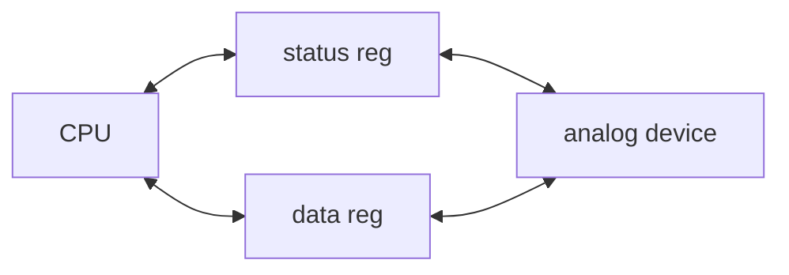
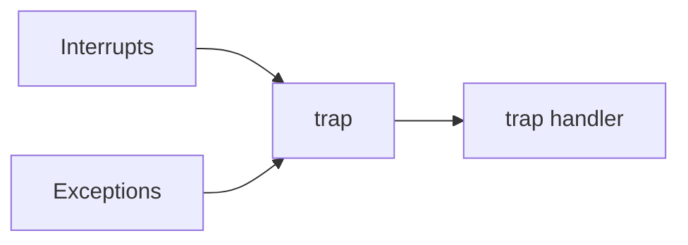

# 嵌入式系统与设计方法学

## 什么是嵌入式系统
Embedded computing system: Any device that includes a programmable computer but is not itself a general-purpose computer

- 嵌入式系统的组成: 
  - 模拟元件: sensors, actuators, etc.
  - ADC/DAC
  - 数字元件: processors, Coprocessors, Memories, Buses; Controllers, Application Specific Hardwares
  - 软件: Operating Systems, Middleware, Applications

基于MCU的设计简单,而且考虑到MCU本身的性能一般效果也不错；也可以用FPGA定制；Heterogeneous systems用定制逻辑完成特定功能,用MCU完成其他功能
{:.success}

- 嵌入式系统具有功能复杂、实时性、低成本、低功耗、设计周期短等特点
  - 实时性: 软实时 (soft real-time), 硬实时 (hard real-time), ?(firm)

## 怎么设计嵌入式系统
例如,需求即应用场景、功能、指标描述,规格类似manual,在此基础上绘制架构框图,划分层次、模块,设计功能,最终集成


- trade-offs:
  - 设计本身: power(energy), performance(?), cost, 
  - 开发过程: time-to-market
  - 使用过程: flexibility, reliability, scalability, complexity, etc.


---

# 嵌入式系统的计算核心: 处理器
考虑设计周期、灵活性、成本,嵌入式系统的处理器可以分为以下几类（可以理解为,在软件编程和硬件实现之间折衷）: 
- General-purpose processors (GP/MCU/单片机)
- Application-Specific Instruction-set Processors (ASIP): 可编程的指令集处理器,介于通用处理器和ASIC之间
- Application-Specific Integrated Circuit (ASIC): 全定制

## 计算机架构
- von Neumann架构: 存储程序计算机,数据和指令存储在同一存储器中,CPU通过总线访问存储器
- Harvard架构: 数据和指令存储在不同的存储器中,CPU通过不同的总线访问存储器, 可以同时访问两处内存(带宽),no self-modifying code

## 指令集架构

|CISC (Complex Instruction Set Computer)|RISC (Reduced Instruction Set Computer)|
|---|---|
|变长指令|定长指令(不一定!)|
|每条指令可以完成多种操作|每条指令完成单一操作(利于流水)|
|多种寻址模式|load/store访存|

寻址模式有立即寻址(直接在指令中给出操作数的值,也就是立即数), 寄存器寻址(操作数在寄存器中), 直接寻址(操作数的地址在指令中以立即数的形式给出), 间接寻址(地址存储在寄存器或内存中), 相对地址(操作数的内存地址=pc+立即数给出的偏移量); RISC
{:.success}

一个好的架构设计出来后,可以根据不同的需求和场景,做出不同的实现版本(微架构),比如不同的主频、总线宽度、缓存大小等
{:.success}

- ARM:  ch2 25
- TI C55x
- RISC-V

## 设备与输入输出



- x86有专用的I/O指令(in, out)
- ARM,RISCV通过内存映射I/O (memory-mapped I/O)来访问设备

由于CPU一直等待设备的信号很低效,因此可以让设备在需要的时候发起中断,CPU做出对应的响应. 
```c
/* 举例,输入传入字符IN_DATA,处理程序放入buffer,写入输出设备OUT_DATA  */
void input_handler() {
    char achar;
    if (full_buffer())
        error = 1;
    else { /* read the character and update pointer */
        achar = peek(IN_DATA); 
        add_char(achar);
    }
    poke(IN_STATUS,0); /* reset status to initiate next transfer */
    /*  if no characters waiting, buffer was empty, start a new output transaction for newly-arrived character */
    if (nchars() == 1) { /* 1 character in buffer */
        poke(OUT_DATA,remove_char()); /* send character */
        poke(OUT_STATUS,1); /* turn device on */
    }
}
void output_handler() {
    if (!empty_buffer()) { /* start a new character */
        poke(OUT_DATA,remove_char()); /* send character */
        poke(OUT_STATUS,1); /* turn device on */
    }
}
```

## 特权级与异常处理
处理器通常有多种特权级,如用户模式(user mode)、监督模式(supervisor mode)、机器模式(machine mode),不同特权级可以访问不同的资源和执行不同的指令. 例如,用户程序运行在用户模式下,不能直接访问硬件设备,只能通过监督模式下的系统调用.


- 何为中断?
  - 同步例外(exception): 指令导致的中断, 如非法指令（illegal instruction）、地址对齐错误（misaligned access）、页缺失（page fault）、环境调用（ECALL）
  - 异步中断(interrupt): 设备发起的中断, 如键盘输入、定时器中断等
  - 自陷(trap): exception和interrupt请求更高的特权级处理的机制

这似乎是riscv的



- 中断处理的两大机制:
  - **中断向量表(interrupt vectors)**: 中断处理程序的入口地址存储在中断向量表中,CPU根据中断来源查找对应的处理程序. 设备中断时向CPU发送中断号,CPU查找中断向量表,跳转到对应的处理程序
  - **中断优先级(interrupt priorities)**: 高优先级的中断会mask和打断低优先级的中断

- 中断处理流程:
  1. 标记中断: 某个正准备处理的中断凭优先级轮到了,保存异常处PC,设置异常来源
  2. 设置本次中断: PC被设置为对应的处理程序入口;(保存原来的中断使能,并设中断使能信号为0);(保存原来的特权级,切换到更高的特权级)
  3. 中断处理程序: 保存寄存器到栈,执行处理程序,恢复寄存器
  4. 恢复中断设置: 2的逆操作


中断除了处理本身的时间,中断前后也是需要时间准备的(要保存与恢复状态,设备与CPU通信中断号),也会耽误分支跳转,还有现代处理器采用的流水线和缓存也会miss. 不幸! 这些时间延迟大多不受控,但我们可以通过写汇编少动几个寄存器来省点时间.
{:.warning}

举例: ARM的中断
- 分为FIQ (Fast Interrupt Request)和IRQ (Normal Interrupt Request), FIQ优先级更高,可以打断IRQ
- **CPU需要保存PC, 复制CPSR到SPSR, 设置CPSR来记录中断, 设置PC为中断向量表中的地址; handler最后需要逆操作, 恢复PC和CPSR, 清除中断屏蔽标志**
- 最坏的情况响应中断就需要27个周期: 2个周期同步外部请求, 20个周期完成手头的指令, 3个周期data abort, 2个周期进入中断处理程序

这也许是arm的


## 内存机制
**存储器的层次结构具有这样的特点: 顶层小而快(贵啊), 底层大而慢, 实现大而快的等效效果.**

### 缓存
访问内存缓慢, 因此需要缓存放指令和数据, 省的CPU苦等. (不能真去 load/store 内存啊)

我们考虑的性能指标:
- 缓存命中率 $t_{avg} = ht_{cache} + (1-h)t_{main}$
  - compulsory miss: 没用过的内存真没有
  - conflict miss: 组相连映射时,两数据块抢一个地方
  - capacity miss: 缓存不够大
- (假设写穿) 访存延迟 = 访存操作数目/程序 * 缓存失效率 * 失效代价

缓存数据的地址:

|tag|index|block offset|
|---|---|---|
|选择数据块(hit?)|选择组|选择数据|

- **映射结构:** 相连提升缓存命中率,但更复杂; 数据块太大失效代价增加
  - 直接映射(direct mapped)/一路组相连: 数据块映射到缓存的确定位置, cache地址 = (块地址) mod (cache中数据块数量)
  - 组相连(set associative): 数据块映射到确定组的任意位置, cache组数 = (块地址) mod (cache中组数)
  - 全相连(fully associative): 数据块可以映射到缓存的任意位置, 需要查找所有缓存块
- **写操作**
  - 写穿透(write-through): 每次写操作都更新缓存和主存, 费时. 
  - 写返回(write-back): 只更新缓存, 当缓存块被替换时才更新主存
  - 使用buffer(减少失效损失), 写入cache时也写入buffer, 再异步写入主存
- **替换策略(降低失效率):** 随机替换, 最近最少使用(LRU), 先进先出(FIFO), 最不经常使用(LFU)

### 虚拟内存
- 分段与分页
  - segment由page组成, segment是逻辑上的, page是物理上的

缺页: 要的页不在内存中. 段错误: 
{:.error}

- TLB (Translation Lookaside Buffer): 用于加速虚拟地址到物理地址的转换, 存储最近使用的页表项

## 评估处理器设计

### 性能
$\text{performance} = \frac{\text{time}}{\text{prog.}} = \frac{\text{instruction}}{\text{prog.}}\times\frac{\text{cycle}}{\text{instruction}}\times\frac{\text{time}}{\text{cycle}}$
- $\frac{\text{instruction}}{\text{prog.}}$ 编译优化,指令集设计
- $\frac{\text{cycle}}{\text{instruction}}$ 优化体系结构,增加InstructionPerCycle
- $\frac{\text{time}}{\text{cycle}}$ 优化电路关键路径,后端物理设计,增加主频 (EDA)

例如, 流水线设计虽不改变一条指令的latency, 可以提高throughput(IPC=1)且频率高, 通过增加电路提高性能; 分支引发停顿,访存时延(尤其是cache miss)会耽误流水效率

### 功耗
功耗源包括:
- 浪涌(启动)功耗: 滤波电容充电, SRAM FPGA配置
- 静态功耗: 待机功耗, 漏电流
- 动态功耗: 最主要, $P_{dynamic} = S C_L V^2_{DD} f_{clk}$

针对的系统级与体系结构级低功耗策略:
- (根据CPU活动)降低工作电压/多电压
- (根据CPU活动)降低工作频率/多频率
- (根据CPU活动)关闭不用的模块
  - enable/disable
  - 电源门控
  - 时钟门控
- 异步设计(自定时)
- 缓存(考虑cache太小/太大会怎么样)

具体如何评估CPU活动是否指示着进入低功耗模式?
- 可能损失的时间和能量
- 分步进行, 状态机

---

# 运行在处理器上的软件

## 描述控制与数据

### 简单模型: 状态机
描述系统控制
### 简单模型: 串行缓存
信号处理, 例如FIR

```c
for (f=0, ibuff=circ_buff_head, ic=0;\
  ic<N; ibuff=(ibuff==N-1?0:ibuff++), ic++)
  f = f + c[ic]*circ_buffer[ibuf];
```

### (Control-)Data Flow Graph


## 代码上板

### 交叉编译 cross-compile


编译器参数

> 编译,解释,与JIT编译
> 编译: 编译完跑
> 解释: 边跑边解释
> JIT编译: 边跑边编译小段代码

### 汇编 assemble
从汇编程序(.s)产生目标机器语言模块(.o), 翻译扩展指令, 把标签,变量等符号生成出相应的地址,数据

符号表像这样:
```
Symbol table '.symtab' contains 28 entries:
   Num:    Value  Size Type    Bind   Vis      Ndx Name
     1: 80000000     0 SECTION LOCAL  DEFAULT    1
     6: 00000000     0 FILE    LOCAL  DEFAULT  ABS add.c
     8: 80000108     1 OBJECT  LOCAL  DEFAULT    2 mainargs
    10: 80009000     0 NOTYPE  GLOBAL DEFAULT    4 _stack_pointer
    15: 80009000     0 NOTYPE  GLOBAL DEFAULT    4 _heap_start
    20: 80000000     0 FUNC    GLOBAL DEFAULT    1 _start
    22: 80000028   180 FUNC    GLOBAL DEFAULT    1 main
    23: 80000109     0 NOTYPE  GLOBAL DEFAULT    2 _data
    27: 8000020c    32 OBJECT  GLOBAL DEFAULT    4 test_data
```

### 链接 link
把目标代码和已经存在的机器语言模块（如函数库或其他程序）等“拼接”起来, 调整地址
- 静态链接(.a)
- 动态链接(.so), procedure linkage

### 加载 load

## 调试与验证
- 调试方法
  - host用cross debugger, 打断点(subroutine call to the monitor, like interrupt); MCU接个in-circuit emulator
  - logic analyzer (oscilloscope array)
  - boundary scan: 将特定信号注入扫描链检测硬件是否故障
  - real-time debug中, 驱动的bug可能会导致UB且time-dependent
- 验证方法
  - black box: 源码不可见, 大量样例
    - 随机测试
    - 回归测试
  - clear (white) box: 对照代码测, 这样可以看到具体的运行路径与中间值(controllability & observability), 可以保证测试覆盖率
    - 圈复杂度 (Cyclomatic complexity): 衡量模块判定结构的复杂度
    - 分支测试 (Branch testing): 测试所有分支跳转的条件true & false
    - 域测试 (Domain testing): 理想情况测试所有输入域, 重点测边缘
    - 循环测试 (Loop testing): 对循环, 可以完全跳过/跑一次/跑多次


## 评估与优化
程序性能评估需要综合考虑硬件系统的特性(流水线,缓存)与软件程序的行为
- measurement-driven
  - 评估性能可以通过仿真,真机跑分(样例程序计算耗时); execution time = program path + instruction timing, 其中不同输入影响path跳转, instruction timing则取决于指令类型与硬件特性(例如,乘除存取指令需要多个时钟,不适应流水线与缓存策略的指令组合需要额外的时间)
  - 实际上不能穷尽输入来找到最佳/最劣情况,也不能看到低层次的状态
  - 性能不是一个固定值,不同的数据输入和状态跳转有average-case/worst-case/best-case execution time的不同
- trace-driven
  - 在评估程序中加上打印trace的功能,用于cache分析
- physical measurement
  - 适合有外界实时输入的系统

举例, 大数组的缓存冲突 5-88

程序的尺寸虽对计算机不算什么瓶颈了, 也是嵌入式必须考虑的
- 优化尺寸可以节省内存, 从而节省功耗
- data方面, 多复用数据, 用指令生成数据
- instruction方面, 避免内联函数(这样没有跳转不复用指令块), 选RISC的CPU, 用专用指令

### 数据结构
5-46

---

# 软硬件协同开发
## 硬件平台: 外设与互连
### 总线
总线是一组共用的线和统一的协议, 通信CPU与外设或者外设与外设. 复杂系统会有多条总线, 分别连接不同性能需求,不同功能类别的设备.
> 比如, CPU和内存通过高速总线(AHB)连接, 而低速I/O设备通过低速总线(APB)连接


总线的一次握手:
1. Device 1 raises enq.
2. Device 2 responds with ack.
3. Device 2 lowers ack once it has finished.
4. Device 1 lowers enq.


- DMA: CPU设置DMA控制器, DMA控制器直接访问内存, CPU不参与数据传输, DMA传输期间总线被占用
### 存储
- DRAM: Dynamic RAM is dense, requires refresh
- SRAM: Static RAM is faster, less dense, consumes more power
- flash: a field-programmable ROM, electrically erasable, must be block erased; Random access, but write/erase is much slower than read; NOR flash is more flexible (read by word), NAND flash is more dense (read by page)
### I/O设备

## 软件系统: 抽象层与精妙控制

> 嵌入式软件与平时用的软件有什么区别
> 嵌入式软硬件的关系紧密, 根据需求, 软件对硬件选择提出要求, 可以用评估板进行测试看看能不能跑起来, 再自己打板; 嵌入式对资源和实时性有很高的要求

### 操作系统
操作系统抽象底层的I/O为文件, 内存与I/O为虚拟内存, CPU与这些外设的占用为进程. 其自动加载安排程序的运行, 为用户程序提供**简单统一而安全**的平台, **切换进程**以实现并发运行的效果(其实是时分复用交错运行), 进程所看到的主存即**虚拟内存**

1. **任务 task**: 要执行的程序, a functional description of a connected set of operations, a collection of processes; 这些任务的速度要求(对速度要求不高的任务只要难得运行一次,实时性强的则不可延误),同步或异步(涉及到I/O), 存在差异, 因此需要管理进程以保证即不浪费也不延误
2. **进程 process**: 操作系统对运行程序的抽象, 每个进程有各自的内存栈和寄存器, 通过上下文切换, 进程交替进行, 系统就可以同时运行多个程序
3. **线程 thread**: 进程的执行单元, 并行的线程之间共享数据, 多线程使得程序运行的更快


### 进程的调度与进程间通信
学会画task graph (6-15)

进程的状态跳转:


- 讨论进程的安排与性能评估:
  - CPU在偷懒吗?
    - 总共$n$个任务, $\tau_i$为第i个进程的周期, $T_i$为需要的计算时间
    - CPU的利用率 $U=\frac{CPU\ time\ for\ useful\ work}{total\ available\ CPU\ time}$
  - CPU来得及吗?
    - 及时完成任务可行性要求 $\tau_1 \ge \sum_{i}{T_i}$
    - 超周期 Hyperperiod: 任务周期的最小公倍数(least common multiple), 
  - 调度策略
    - **Rate-monotonic scheduling (RMS)**: 静态调度, 周期越短赋予越高优先级. CPU的利用率又可以表示为 $U= \sum{\left( \frac{T_i}{\tau_i} \right)}=\frac{\sum{(T_i\prod{\tau}/\tau_i)}}{hyperperiod} < n(2^{1/n}-1)$, 注定无望100%
    - **Earliest-deadline-first (EDF)**: 动态优先级, 越来不及的赋予越高优先级, 理论可以100%利用率, 但可能赶不上ddl, 还费资源
    - **周期静态(Cyclostatic) / 时分多址(TDMA)**: 基于LCM调度, CPU利用率不变(且高), 不能处理意外负载. CPU的利用率又可以表示为 $U= \frac{\sum{T_i}}{TDMA\ period}$
    - **轮询(Round-robin)**: 按照相同的顺序检测各个进程是否就绪,如果当前进程不干,就会直接执行下一个. 调度周期即超周期. 可以处理很多甚至意外负载
  - 要是真的调度不好了? (参考slack为负怎么办)
    - ($\tau_i$) 改ddl
    - ($T_i$) 减少进程需要的计算时间
    - ($f_{clk}$) 换个好CPU
  - 还有一些乱七八糟的问题
    - 优先级反转 priority inversion: 比如, 低优先级进程霸着I/O, 高有效级跑不了, 导致的死锁
    - 数据依赖
    - 上下文切换时间


- 进程间通信 6-53 6-85: 进程通过OS通信传数
  - blocking(发送的进程等回复), non-blocking(发送的进程继续)
  - 共享内存
    - 2个进程同时写一个内存位置的冲突 -> 原子操作(atomic test-and-set)不可分割, 只能全部失败/全部成功; SWP指令读内存,测试,写入
  - 通道传信
UML

出现的术语: task, process, thread, multi-rate, real-time, release time, deadline(hard/soft/firm), rate & period, initiation time & interval, hyperperiod, response time, critical instant & region, semaphores
{:.warning}

## 系统性能分析
- 通信带宽: 
  - $T_{basic}(N)=\frac{(Data\ transfer + Overhead)(Number\ of\ data)}{(bus\ Width)}$
  - $T_{burst}(N)=\frac{((Burst) (Data\ transfer) + Overhead)(Number\ of\ data)}{(Burst) (bus\ Width)}$
  - 通信的瓶颈在于内存还是总线?计算
  - 通过提高并行性提高效率: 一次传多个, DMA, fpga
- 能量与功耗
  - 一般来说, high performance = low energy, speed-energy之间没有什么trade-off的余地. 主要考虑: 寄存器的高效使用, 缓存尺寸与冲突, 展开循环与函数嵌套(内联), 流水线优化
  - 操作系统通过关掉一些单元来降低功耗, 而关与开的操作也是额外耗能的. 因此需要合理调节, 简单的功耗管理策略有 request-driven 与 predictive shutdown, 前者一旦有请求就开启, 后者预测多久会有请求
  - Advanced Configuration Power Interface: 在mechanical off, soft off, sleeping state, working state状态之间切换
- RTOS: 6-95
  

---

# 多处理器