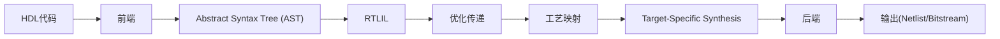

see https://deepwiki.com/YosysHQ/yosys
## 工作流程

| Subsystem      | Function                                 | Data Format                 |
|----------------|------------------------------------------|-----------------------------|
| yosys_setup    | Initialize environment                   | -                           |
| run_frontend   | Read in HDL               | HDL source → AST → RTLIL    |
| run_pass       | Transform/optimize design                 | RTLIL                       |
| run_backend    | Output design                            | RTLIL → Netlist             |
| yosys_shutdown | Cleanup and shutdown                     | -                           |


### 控制与数据流相关定义

- 前端(frontend): 第一个被调用的子系统, 它不处理另一个子系统产生的数据, 而是读取用户输入
- 通道(passes): 中间级的子系统, 从前一个子系统获取数据, 并为下一个子系统产生数据; 这里, Pass只用于在RTLIL数据结构上操作的命令
- 后端(backend): 最后一个子系统, 将最后一次pass产生的数据转换为合适的输出格式, 并写入磁盘文件

Yosys中这些子系统基本都可以直接作为命令在综合脚本中使用
eg


### 启动

> 标准版本使用shell()函数提供完整的交互式环境,而EMSCRIPTEN版本通过run函数提供单命令执行接口,更适合Web环境的异步调用模式.
> 后者提供三个主要接口函数:
> - `run(const char *command)` - 执行命令
> - `errmsg()` - 获取错误信息
> - `prompt()` - 获取提示符

EMSCRIPTEN版本主函数位于`driver.cc`,调用`yosys.cc`中的`yosys_setup()`来初始化系统.如果程序收到了一个命令行参数,将第一个参数`argv[1]`作为*脚本*文件来进行前端处理;没有特殊参数时,启动*交互式shell*,实际的命令执行通过导出的`run()`函数来处理.(int main没有显式返回，函数会隐式返回0)

```cpp
int main(int argc, char **argv)
{
	EM_ASM(
		if (ENVIRONMENT_IS_NODE)
		{
			FS.mkdir('/hostcwd');
			FS.mount(NODEFS, { root: '.' }, '/hostcwd');
			FS.mkdir('/hostfs');
			FS.mount(NODEFS, { root: '/' }, '/hostfs');
		}
	);

	mkdir("/work", 0777);
	chdir("/work");
	log_files.push_back(stdout);
	log_error_stderr = true;
	yosys_banner();
	yosys_setup();

...

	if (argc == 2)
	{
		// Run the first argument as a script file
		run_frontend(argv[1], "script");
	}
}
```


`run(const char *command)`函数保存选择栈状态,通过`run_pass(command)`调用Pass执行逻辑,将系统推入新的选择状态.执行过程中捕获异常并进行状态恢复.
选择栈`selection_stack: vector<Selection>`存放的是`RTLIL::Selection`对象,每个Selection对象代表设计中当前被选中的元素集合,包含以下核心数据:
- selected_modules,存储完整选中的模块名称,以IdString(字符串标识符)的形式存储
- selected_members,存储部分选中模块的具体成员(如wire,cell)
- 选择标志,包括是否全选、是否包含黑盒模块等状态信息

```cpp
void run(const char *command)
{
	int selSize = GetSize(yosys_get_design()->selection_stack);
	try {
		log_last_error = "Internal error (see JavaScript console for details)";
		run_pass(command);
		log_last_error = "";
	} catch (...) {
		while (GetSize(yosys_get_design()->selection_stack) > selSize)
			yosys_get_design()->selection_stack.pop_back();
		throw;
	}
}
```

标准版本的main函数是一个功能完整的命令行程序入口,主要包括:
1. 变量初始化和选项定义:函数首先定义了大量的配置变量和命令行选项,然后使用cxxopts库定义了三个主要的选项组：操作选项(operation,前端、后端、脚本文件等),日志选项(logging,控制输出格式和日志记录),开发者选项(developer,调试和性能分析相关)
2. 命令行参数解析:`auto result = options.parse(argc, argv);`
3. 系统初始化:调用`yosys_setup()`函数
4. 文件处理和命令执行:函数按顺序处理不同类型的输入,处理前端文件->执行脚本文件->执行Pass命令
5. 交互式模式或后端输出:根据配置决定是启动交互式shell(`shell(yosys_design)`)还是执行后端输出(`run_backend(output_filename, backend_command)`)

`yosys_setup()`函数为公共接口,设置共享目录路径和ABC工具路径,初始化RTLIL中使用的预定义标识符,调用Pass::init_register()注册所有Pass,创建全局的RTLIL设计对象,设置内置单元类型库,推入日志栈

```cpp
void yosys_setup()
{
	if(already_setup)
		return;
	already_setup = true;
	init_share_dirname();
	init_abc_executable_name();

#define X(_id) RTLIL::ID::_id = "\\" # _id;
#include "kernel/constids.inc"
#undef X
...

	Pass::init_register();
	yosys_design = new RTLIL::Design;
	yosys_celltypes.setup();
	log_push();
}
```

对应的,`yosys_shutdown`函数在结束时清理资源

## 前端解析
Verilog前端将HDL转换为AST, 由Preprocessor, Lexer, Parser三个部分组成
AST前端将AST转换为RTLIL, 由Simplifier, RTLIL Generator组成
### AST(abstract syntax tree)的数据结构

AST节点在Yosys中主要通过`AstNode`结构体实现
- 包括以下成员:
	- `AstNodeType type`: 每个AST节点都有一个类型(如`AST_DESIGN, AST_MODULE, AST_TASK, AST_FUNCTION, AST_DPI_FUNCTION,AST_WIRE`等), 定义在`AstNodeType`枚举中 (see Table 4.1: AST node types with their corresponding Verilog constructs.)
	- `std::vector<AstNode*> children`: AST采用树形结构, 每个节点通过`children`向量存储其子节点
	- `std::map<RTLIL::IdString, AstNode*> attributes`: 节点可以携带Verilog属性, 存储在`attributes`映射中 (属性值也是AST节点);
	- node content: 一些很多时候不常用的verilog属性, 如`bool is_input, is_output, is_reg, is_logic, is_signed, is_string; uint32_t integer; double realvalue;`
	- `std::string filename, int linenum`: 在源码的位置

- 通过构造函数创建, 初始化所有成员变量，接受最多4个子节点作为参数:
	`AstNode::AstNode(AstNodeType type, AstNode *child1, AstNode *child2, AstNode *child3, AstNode *child4)`

- 节点深度克隆操作(deep recursive copy):
	`AstNode *AstNode::clone() const`
	


### RTLIL中间形式
AST经过简化处理后, 通过`genRTLIL()`方法转换为RTLIL表示: 递归处理AST节点, 为表达式生成相应的电路, 并返回信号规格
RTLIL(Register-Transfer-Level-Intermediate-Language)是Yosys中贯穿始终的核心中间表示形式,作为中央数据结构，是前端解析器生成的目标格式,所有优化处理流程的操作对象,后端代码生成器的输入源.



RTLIL的生成通常分为两个阶段：
1. 前端解析器生成抽象语法树(AST):以Verilog解析器为代表的前端工具首先构建AST,该过程由各语言前端的独立解析器完成
2. AST到RTLIL的转换:通过genrtlil.cc中的转换函数实现,形成完整的寄存器传输级中间表示

具体转换规则处理以下Verilog结构：

|结构类型 |转换目标|
|-------|-------|
|顶层设计|RTLIL::Design对象|
|模块定义(module)|RTLIL::Module对象|
|线网声明(wire) |RTLIL::Wire对象|
|单元实例化 | RTLIL::Cell对象|
|always语句块 | RTLIL::Process对象|
|多个信号位|RTLIL::SigSpec对象|
|常量或线网|RTLIL::SigBit对象|


### 传递管理
Yosys中的传递管理系统为硬件设计转换操作提供了定义、注册和执行的框架.
'Pass'是指对设计进行转换,分析或执行实用功能的独立操作,作为综合流程的基础构建模块.


`Pass`是一个抽象基类，定义了所有变换操作的统一接口.每个Pass都有唯一标识名称和执行方法，本质上就是一条可执行的指令.在初始化时，所有Pass都会注册到全局的`pass_register`映射表中,这样就可以通过名称来查找和调用它们.通过命令行或脚本调用这些名称,系统会解析命令字符串,查找对应的Pass并执行.

```
# 一般可以用这样的格式调用:
pass_name [options] [selection]
# 例如:
opt -full top_module
```

## 后端系统

## 优化


---

> 函数开头的std::vector<std::string> args;是什么意思?
> 这个声明创建了一个可以动态增长的字符串数组,初始为空(0个元素),可以像数组一样通过索引访问(如`args[0]`),提供`push_back()`等方法添加元素
> `std::vector`即是std命名空间中的动态数组容器vector
> `<std::string>`是模板参数，指定vector中存储的元素类型为标准字符串类


> Yosys中的`pass_register`以及`register.cc`文件中其他寄存器的用途

`pass_register`是Yosys中用于注册和管理所有Pass（处理步骤）的全局映射表，它将Pass名称映射到对应的Pass对象指针。 [1](#0-0) 

在`register.cc`中定义了三个核心寄存器：<cite/>

1. **`pass_register`** - 存储所有Pass（包括Frontend和Backend） [1](#0-0) 
2. **`frontend_register`** - 专门存储Frontend（输入格式解析器） [2](#0-1)   
3. **`backend_register`** - 专门存储Backend（输出格式生成器） [3](#0-2) 

Pass通过以下流程注册到这些寄存器中：<cite/>

1. **构造时排队**：Pass在构造函数中被添加到队列 [4](#0-3) 
2. **批量注册**：`Pass::init_register()`遍历队列并调用每个Pass的`run_register()` [5](#0-4) 
3. **实际注册**：`run_register()`将Pass添加到相应的寄存器中 [6](#0-5) 

这些寄存器在Pass执行时被使用：<cite/>

- **命令查找**：当用户执行命令时，系统通过`pass_register`查找对应的Pass [7](#0-6) 
- **执行Pass**：找到Pass后调用其`execute()`方法 [8](#0-7) 
- **帮助系统**：`help`命令遍历`pass_register`显示所有可用命令 [9](#0-8) 

Frontend和Backend继承自Pass，但有额外的注册逻辑：<cite/>

- **Frontend注册**：同时注册到`pass_register`和`frontend_register` [10](#0-9) 
- **Backend注册**：同时注册到`pass_register`和`backend_register` [11](#0-10) 

## Yosys的TCL接口
`static int tcl_yosys_cmd(ClientData, Tcl_Interp *interp, int argc, const char *argv[])`
这是标准的TCL命令回调函数签名:其中ClientData是TCL的客户端数据(这里未使用),`Tcl_Interp *interp`是TCL解释器指针
当第一个参数是-import时，函数会将所有Yosys Pass导入为TCL命令

```cpp
	if (args.size() >= 1 && args[0] == "-import") {
		for (auto &it : pass_register) {
			std::string tcl_command_name = it.first;
			if (tcl_command_name == "proc")
				tcl_command_name = "procs";
			else if (tcl_command_name == "rename")
				tcl_command_name = "renames";
			Tcl_CmdInfo info;
			if (Tcl_GetCommandInfo(interp, tcl_command_name.c_str(), &info) != 0) {
				log("[TCL: yosys -import] Command name collision: found pre-existing command `%s' -> skip.\n", it.first.c_str());
			} else {
				std::string tcl_script = stringf("proc %s args { yosys %s {*}$args }", tcl_command_name.c_str(), it.first.c_str());
				Tcl_Eval(interp, tcl_script.c_str());
			}
		}
		return TCL_OK;
	}
```
使用C++的异常处理来捕获Yosys命令执行中的错误:调用`Pass::call(args)`,如果出现`log_cmd_error_exception`异常,作出响应
